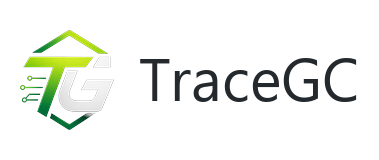
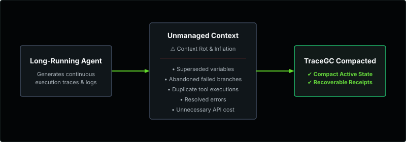
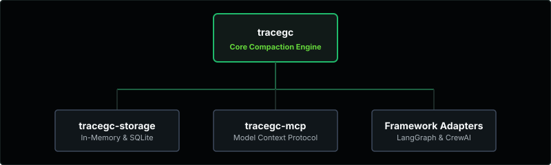

<div align="center">
  <a href="https://tracegc.vercel.app">
    <picture>
      <source media="(prefers-color-scheme: dark)"
              srcset="docs/assets/tracegc-logo-horizontal-dark.svg">
      <source media="(prefers-color-scheme: light)"
              srcset="docs/assets/tracegc-logo-horizontal-light.svg">
      
    </picture>
  </a>
</div>

<p align="center">
  <a href="https://tracegc.vercel.app">Playground</a> •
  <a href="SPEC.md">Specification</a> •
  <a href="WRITEUP.md">Writeup</a> •
  <a href="tracegc/benchmark/benchmark_report.md">Benchmarks</a> •
  <a href="https://github.com/tracegc/tracegc/issues">Issues</a>
</p>

### Deterministic context compaction for production AI agents.

**Keep the context that matters. Compact what no longer does. Recover what you need.**

TraceGC is an open-source library and platform for deterministic context management in AI agent systems. It enables developers building stateful agent workflows to safely reduce LLM token consumption and avoid stale-context confusion by structurally pruning obsolete execution paths and redundant actions. Operating entirely locally and deterministically, TraceGC ensures that critical agent history remains compact, correct, and fully recoverable without the added latency, variability, or cost of LLM-based summarization routines.

TraceGC was originally created as a deterministic alternative to AI-based context summarization for agent workflows. It was designed to bridge the gap between lossy conversation truncation and expensive model-driven context rewrites, providing absolute safety guarantees and local sub-millisecond execution.

<p>
  <a href="https://tracegc.vercel.app"><strong>Learn more about TraceGC →</strong></a>
</p>

<p align="center">
  <a href="https://pypi.org/project/tracegc/"></a>
  <a href="https://pypi.org/project/tracegc/"></a>
  <a href="LICENSE"></a>
  <a href="https://tracegc.vercel.app"></a>
  <a href="https://colab.research.google.com/github/tracegc/tracegc/blob/main/demo/colab_demo.ipynb"></a>
</p>

### ⚡ Quick Install

```bash
pip install tracegc
```

| **Deterministic** | **Recoverable** | **Local** |
| :--- | :--- | :--- |
| Predictable pruning | Receipt-based stubs | Sub-millisecond execution |
| Zero-dep core | Framework agnostic | High efficiency |

---

## ❓ Why TraceGC?

<p align="center">
  
</p>

### Context Compaction Demonstration
<p align="center">
  
</p>

#### Before vs. After Visual Comparison

*   **Full History (Before)**:
    *   Growing execution context containing obsolete variables, failed branches, duplicate tool runs, and resolved errors.
*   **Compacted Context (After)**:
    *   Only the required current state and active execution path are kept. Obsolete steps are replaced with inline `[RECEIPT node_id]` stubs.

### Key Compaction Pillars
*   **Deterministic Pruning** — Operates on exact directed multigraph representations with absolute safety guarantees and no stochastic LLM calls.
*   **Recoverable Receipts** — Pruned steps leave behind lightweight inline stubs (`[RECEIPT node_id]`) to maintain history context while keeping raw content fully restorable on-demand.
*   **Local Performance** — Executes locally in sub-milliseconds with zero API costs, avoiding network roundtrips and model latencies.
*   **Framework Agnostic & Composable** — Integrates seamlessly as a zero-dependency pre-filter upstream of any agent loop, model provider, or native compaction tool.

---

## ⭐ Features

<table width="100%">
  <tr>
    <td width="33%" valign="top">
      <br />
      <strong>Deterministic & Safe</strong><br />
      <sub>Guaranteed-safe pruning with no hallucination or summarization risks.</sub>
    </td>
    <td width="33%" valign="top">
      <br />
      <strong>Local & Fast</strong><br />
      <sub>Runs entirely locally with sub-millisecond execution.</sub>
    </td>
    <td width="33%" valign="top">
      <br />
      <strong>Token Efficient</strong><br />
      <sub>Reduces token usage without losing important context.</sub>
    </td>
  </tr>
  <tr>
    <td width="33%" valign="top">
      <br />
      <strong>Fully Recoverable</strong><br />
      <sub>Any pruned context can be reconstructed perfectly when needed.</sub>
    </td>
    <td width="33%" valign="top">
      <br />
      <strong>Easy Integration</strong><br />
      <sub>Simple Python API with seamless LLM and agent framework support.</sub>
    </td>
    <td width="33%" valign="top">
      <br />
      <strong>Open & Extensible</strong><br />
      <sub>Apache 2.0 licensed and built for extensibility.</sub>
    </td>
  </tr>
</table>

---

## 🚀 Quick Start

Follow these logical steps to integrate TraceGC:

#### 1. Install
```bash
pip install tracegc
```

#### 2. Import & Initialize
```python
from tracegc import TraceGC
client = TraceGC()
```

#### 3. Add events incrementally as they occur
```python
client.add_event({
    "id": "e001", 
    "type": "decision", 
    "timestamp": 1000, 
    "parent_id": None, 
    "content": "Start configuration"
})
client.add_event({
    "id": "e002", 
    "type": "set_var", 
    "timestamp": 1010, 
    "parent_id": "e001", 
    "key": "x", 
    "value": 10
})
client.add_event({
    "id": "e003", 
    "type": "set_var", 
    "timestamp": 1020, 
    "parent_id": "e002", 
    "key": "x", 
    "value": 20  # Supersedes x=10
})
```

#### 4. Compact & Inspect Results
```python
# Compact the context history on-demand
result = client.compact()

# Access the compacted prompt prefix
print(result["prompt"])
# Output: [RECEIPT e002]\nx = 20
```

---

## ⚙️ How It Works

TraceGC compiles your agent's execution logs through five pipeline stages:

<p align="center">
  
</p>

1.  **Dead-Branch Sweeper**: Traces and removes aborted tool executions and failed branches starting from `abandon` markers.
2.  **Override Engine**: Identifies variable updates (`set_var`) and retains only the latest active state per key.
3.  **Deduplication Engine**: Automatically deduplicates identical consecutive tool calls (`tool_call`/`tool_result`).
4.  **Topological Sampler**: Detects structural dependency cycles and collapses them to resolve strongly connected loops.
5.  **Semantic Pruning**: Resolves semantic equivalents, error paths, obsolete file reads, and redundant successful verifications.

*For formal definitions, refer to the [TraceGC Specification](SPEC.md).*

---

## 🎫 Receipts & Event Recovery

To prevent context compaction from causing permanent "memory loss," TraceGC employs a deterministic receipt recovery model. Pruned events are never discarded from memory; they are converted into lightweight inline receipt stubs (e.g., `[RECEIPT node_id]`). Callers can recover the complete, original event dictionary (including arguments, tool names, and return values) at any time by calling `get_receipt(graph, node_id)`.

<p align="center">
  
</p>

```python
# Call get_receipt from the TraceGC client instance:
print(client.get_receipt("e002"))
# Returns:
# {'id': 'e002', 'type': 'set_var', 'timestamp': 1010, 'parent_id': 'e001', 'key': 'x', 'value': 10, 'pruned': True}
```

---

## 🌐 Ecosystem

<p align="center">
  
</p>

| Package | Role | Source / Docs |
| :--- | :--- | :--- |
| **`tracegc`** | Core engine, event schemas, deduplication, and compaction pipeline. | [Core Package](./) |
| **`tracegc-storage`** | In-Memory & SQLite persistence/backends. | [`tracegc-storage`](./tracegc-storage) |
| **`tracegc-mcp`** | Model Context Protocol integration. | [`tracegc-mcp`](./tracegc-mcp) |
| **`tracegc-langgraph`** | LangGraph middleware and lifecycle adapters. | [`tracegc-langgraph`](./tracegc-langgraph) |
| **`tracegc-crewai`** | CrewAI task/agent context adapters. | [`tracegc-crewai`](./tracegc-crewai) |

---

## 📊 Benchmarks

TraceGC is continuously validated against synthetic and natural agent execution logs. The table below summarizes the compaction and probe accuracy results compared to truncation and AI-driven summarization across short, medium, and long traces.

### 📈 Benchmark Snapshot
*   **Full History**: Preserves 100% of information but experiences complete context window bloat.
*   **Truncation**: Smallest size but destroys 100% of medium/long recall and decision paths.
*   **AI Summarization**: Latency and token cost overhead, non-deterministic, and drops decision rationale (0% accuracy).
*   **TraceGC**: **Only method scoring 100% on correctness/recall probes** across all tested trace lengths, with substantial token reduction.

### Full Results Table

| Trace Size | Compaction Method | Average Tokens | Recall Accuracy | Artifact Accuracy | Continuation Accuracy | Decision Accuracy | Deterministic |
| :--- | :--- | :--- | :--- | :--- | :--- | :--- | :--- |
| **Short** | full_history | 121.0 | 100% | 100% | 100% | 100% | n/a |
| | truncate_by_event_count | 116.3 | 100% | 100% | 100% | 100% | n/a |
| | ai_summarize_single | 90.7 | 100% | 33.3% | 55.6% | 0.0% | No |
| | **tracegc_pipeline** | **75.3** | **100%** | **100%** | **100%** | **100%** | **Yes** |
| **Medium** | full_history | 379.7 | 100% | 100% | 100% | 100% | n/a |
| | truncate_by_event_count | 133.3 | 0.0% | 100% | 0.0% | 0.0% | n/a |
| | ai_summarize_single | 146.7 | 66.7% | 88.9% | 100% | 0.0% | No |
| | ai_summarize_recursive | 131.0 | 0.0% | 66.7% | 100% | 0.0% | No |
| | **tracegc_pipeline** | **299.0** | **100%** | **100%** | **100%** | **100%** | **Yes** |
| **Long** | full_history | 1301.0 | 100% | 100% | 100% | 100% | n/a |
| | truncate_by_event_count | 104.3 | 0.0% | 0.0% | 0.0% | 0.0% | n/a |
| | ai_summarize_single | 243.4 | 100% | 0.0% | 100% | 0.0% | No |
| | ai_summarize_recursive | 219.2 | 100% | 0.0% | 100% | 0.0% | No |
| | **tracegc_pipeline** | **1028.3** | **100%** | **100%** | **100%** | **100%** | **Yes** |

For a complete breakdown of latencies, token-count truncation, and per-tier metrics, see the [Comparative Benchmark Report](tracegc/benchmark/benchmark_report.md).

---

## 🔍 Explore TraceGC

Try TraceGC interactively in the web playground or run the deterministic benchmarks locally:

*   **[Open Web Playground →](https://tracegc.vercel.app)**
*   **[Run Benchmarks Locally →](tracegc/benchmark/benchmark_report.md#reproducing-the-benchmark)**

---

## 🛠️ Technical Deep Dive

<details>
<summary><strong>Expand to view detailed architecture, event schemas, prior art comparisons, and implementation caveats</strong></summary>

### Architecture & Description

TraceGC is a framework-agnostic, installable library combining deterministic graph-based pruning with recoverable receipts. While existing tools (such as Self-GC, ClawVM, Cognee, ContextNest, Headroom, and MemGPT/Letta) split these approaches across research papers, hosted SaaS products, client-side compressors, or LLM-based summarization routines, TraceGC ships as a simple, drop-in, zero-dependency Python library designed for developers building stateful agent workflows.

By modeling the agent's interaction history (execution traces) as a directed multigraph, TraceGC identifies and removes obsolete or superseded steps, dead execution branches, and cycles. When elements are pruned, TraceGC leaves behind lightweight, deterministic *receipt stubs* inline, allowing agents to preserve awareness of their history. Furthermore, the complete original content of any pruned step remains fully recoverable on-demand.

#### Entry Points

*   **`TraceGC` (Recommended for Agent Loops)**: An incremental-friendly wrapper class. It allows you to append events one by one as they happen (`add_event()`) and call `compact()` on demand. This is the recommended entry point for long-running agent loops where history grows step-by-step.
*   **`compact_events()` (Single-Shot)**: A low-level function that accepts a static list of event dictionaries and returns the compacted output in a single call. Best for post-mortem processing or batch compaction pipelines.

#### Storage Backends (In-Memory & SQLite)

`TraceGC` supports customizable storage backends via `tracegc-storage`. By default, `TraceGC()` uses in-memory storage (`MemoryStore()`). To persist session events and receipts across restarts, pass a `SQLiteStore`:

```python
from tracegc import TraceGC
from tracegc_storage import MemoryStore, SQLiteStore

# 1. Default in-memory usage
client_mem = TraceGC()  # uses MemoryStore()

# 2. SQLite-backed usage (persists to file)
store = SQLiteStore("agent_history.db")
client_db = TraceGC(store=store, context_id="session_123")

client_db.add_event({
    "id": "e001", "type": "set_var", "timestamp": 1000, "key": "model", "value": "v1"
})
client_db.add_event({
    "id": "e002", "type": "set_var", "timestamp": 2000, "key": "model", "value": "v2"
})
res = client_db.compact()

# Re-opening a new client instance with the same DB file and context_id restores trace history
client_reloaded = TraceGC(store=SQLiteStore("agent_history.db"), context_id="session_123")
res_reloaded = client_reloaded.compact()
print(res_reloaded["prompt"])
```

---

### LLM Middleware Adapters

TraceGC provides concrete integration helper functions for popular LLM provider libraries. These helper functions are optional (lazy-loaded inside the functions), so the core `tracegc` package remains completely dependency-free.

To use these adapters, ensure you install the corresponding package first:

```bash
# To use the Anthropic adapter
pip install anthropic

# To use the OpenAI adapter
pip install openai
```

#### Usage Example

```python
from tracegc import TraceGC
from tracegc.middleware import call_openai_with_compaction

# Build and populate your context
client = TraceGC()
client.add_event({"id": "e1", "type": "set_var", "timestamp": 1000, "parent_id": None, "key": "x", "value": 10})
client.add_event({"id": "e2", "type": "set_var", "timestamp": 1010, "parent_id": "e1", "key": "x", "value": 20})

# Call the model; the adapter automatically handles compaction of history 
# and sends the compacted prompt as the system prefix.
res = call_openai_with_compaction(
    tracegc=client,
    model="gpt-4o-mini",
    user_message="Explain what value x holds.",
    api_key="your-openai-api-key"  # Optional, falls back to env var
)

print(res["response_text"])
print(res["metrics"]) # {input_tokens, output_tokens, tokens_before, tokens_after}
```

---

### Event Schema

TraceGC validates incoming events according to five structured types defined in `tracegc/events.py`:

*   **`set_var`**: Used to update state variables.
    *   *Required fields*: `id`, `type`, `timestamp`, `key`, `value`
*   **`tool_call`**: Represents a tool execution request.
    *   *Required fields*: `id`, `type`, `timestamp`, `tool_name`, `arguments`
*   **`tool_result`**: Captures the execution result of a tool.
    *   *Required fields*: `id`, `type`, `timestamp`, `call_id`, `result`
*   **`abandon`**: Denotes abandoning a path.
    *   *Required fields*: `id`, `type`, `timestamp`, `ref_to` (list of target node IDs to prune)
*   **`decision`**: Describes a transition logic or agent choice.
    *   *Required fields*: `id`, `type`, `timestamp`, `content`

*All events support an optional `parent_id` (string) field to map the sequential execution path.*

#### Coding Agent Event Types (Schema v0.3.0+)

*   **`file_read`**: Reads a file payload.
    *   *Required fields*: `id`, `type`, `timestamp`, `path` (non-empty string)
*   **`file_edit`**: Edits a file.
    *   *Required fields*: `id`, `type`, `timestamp`, `path` (non-empty string), `diff_hash` (non-empty string hash of the change)
*   **`command_run`**: Runs a terminal command.
    *   *Required fields*: `id`, `type`, `timestamp`, `command` (non-empty string), `exit_code` (integer)
*   **`test_run`**: Runs test cases.
    *   *Required fields*: `id`, `type`, `timestamp`, `test_names` (list of strings), `exit_code` (integer), `passed_count` (integer), `failed_count` (integer)
*   **`build_run`**: Runs a build task.
    *   *Required fields*: `id`, `type`, `timestamp`, `exit_code` (integer)
*   **`git_diff`**: Shows repository diff.
    *   *Required fields*: `id`, `type`, `timestamp`, `diff_hash` (non-empty string), `files_changed` (list of strings)
*   **`git_commit`**: Creates a git commit.
    *   *Required fields*: `id`, `type`, `timestamp`, `commit_hash` (non-empty string), `message` (non-empty string)
*   **`error`**: Signals an error execution.
    *   *Required fields*: `id`, `type`, `timestamp`, `message` (non-empty string)
    *   *Optional field*: `related_to` (non-empty string ID of the causing event, or None)
*   **`artifact_created`**: Generates a file artifact.
    *   *Required fields*: `id`, `type`, `timestamp`, `artifact_type` (non-empty string), `path` (non-empty string)
*   **`requirement`**: Defines a system requirement.
    *   *Required fields*: `id`, `type`, `timestamp`, `content` (non-empty string)
*   **`constraint`**: Defines a system constraint.
    *   *Required fields*: `id`, `type`, `timestamp`, `content` (non-empty string)
*   **`verification`**: Asserts a verification check.
    *   *Required fields*: `id`, `type`, `timestamp`, `content` (non-empty string), `passed` (boolean)

---

### Prior Art & Related Work

The problem of managing long-context window limits and cost in agentic systems is an active area of research and engineering. Related approaches include:
*   **Provider-Native Compaction (Anthropic, OpenAI, Google)**: Compaction built directly into the model provider's API or agent framework — e.g. Anthropic's `compact` API (configurable thresholds, custom summarization prompts, available across Claude API/Bedrock/Vertex/Foundry), OpenAI's Codex-Max/Codex models trained to prune their own history as a native model objective, and Google ADK's compaction architecture. These require no separate library, but compact by having a model summarize or rewrite history — the same class of approach as "AI-Driven Summarization" below, just integrated at the provider layer instead of bolted on by the developer.
*   **Content-Level Compression (Headroom)**: Compresses the content of individual messages or tool outputs as they arrive (routing JSON, logs, or text to specialized per-type compressors, including the trained ML-based compressor *Kompress*) while leaving the historical conversation structure untouched to maximize provider KV-cache hits.
*   **Graph-based Memory Systems & Knowledge Graphs**: Tools (like Cognee) that structure agent experiences as entity-relation networks rather than linear logs.
*   **OS-Inspired Memory Architectures**: Frameworks (such as MemGPT/Letta) that treat context management analogously to operating system paging, moving data between virtual memory and disk.
*   **Hosted Memory & Vector Databases**: SaaS platforms and databases that offer retrieval-augmented generation (RAG) and search workflows over raw text memories.
*   **AI-Driven Summarization**: Naive LLM calls that periodically summarize history logs into shorter paragraphs.

#### Provider-Native Compaction vs. TraceGC

As of 2026, model providers increasingly ship compaction as a built-in feature rather than something developers bolt on themselves. This is a meaningfully different animal from TraceGC, not a competing implementation of the same idea:

*   **Provider-native compaction is model-driven.** Whether it's an explicit summarization call (Anthropic's `compact` API) or a pruning behavior trained directly into the model (OpenAI's Codex-Max), the decision about what to keep is made by a model reading the history and rewriting or dropping parts of it. That is a more sophisticated version of the same "AI-Driven Summarization" category above, with the same fundamental tradeoff: it is not deterministic, output differs run to run, and (per TraceGC's own benchmark) this class of approach has historically scored well on recall but near-zero on preserving the *rationale behind a decision* — the exact failure mode now widely referred to in the industry as "context rot."
*   **TraceGC is structure-driven.** It doesn't ask a model what to keep; it computes what is already provably dead — a state variable that's been overwritten, a tool call that's an exact duplicate, a branch that was explicitly abandoned — and removes only that, leaving a recoverable receipt behind. Nothing is ever summarized or paraphrased.
*   **These are not mutually exclusive.** TraceGC is not positioned as a replacement for provider-native compaction — it's a deterministic pre-filter that can run *before* it. Pruning the provably-dead branches and superseded state out of a trace first means a provider's `compact` call (or a trained-in pruning pass) has less redundant, already-obsolete material to summarize, and fewer opportunities to accidentally summarize away something that mattered. Teams already using a provider's native compaction don't need to rip it out to adopt TraceGC — TraceGC can sit upstream of it in the pipeline.

#### Headroom vs. TraceGC

A primary architectural distinction exists between **Headroom** and **TraceGC**:
*   **Headroom** compresses the *content* of individual messages/tool-outputs as they arrive—routing JSON/code/logs/text to per-type compressors (one of which, *Kompress*, uses a trained ML model, not pure determinism), and explicitly leaves prior conversation history untouched to preserve provider KV-cache hits. Headroom decides what to keep small on the way in.
*   **TraceGC** solves a different layer: given an agent's already-accumulated structured event history, it identifies which parts are now dead (superseded, abandoned, or cyclical) and structurally removes them. TraceGC decides what should still exist at all once it is already there.

The two approaches are complementary rather than competing: Headroom shrinks new incoming tool outputs, while TraceGC prunes stale state from history. Furthermore, TraceGC's entire pipeline has zero ML/AI models anywhere, including in the pruning logic itself, whereas Headroom's is deterministic for some content types but uses a trained model for general text. Additionally, Headroom's memory-layer deduplication explicitly relies on an LLM call to judge whether two facts should be merged ('LLM-Mediated Dedup'), whereas TraceGC's deduplication is exact-match on tool name, arguments, and result — fully deterministic, with no model call anywhere in the decision.

#### TraceGC's Niche

TraceGC does not compete with hosted retrieval systems, general-purpose cognitive architectures, or provider-native compaction. Its niche is defined by:
1.  **Lightweight & Dependency-Free**: It is an offline, installable Python library with zero external package dependencies.
2.  **Deterministic Core & Semantic Cache**: It operates on structured schemas (`set_var`, `tool_call`, etc.), and optionally extracts and normalizes unstructured natural language logs into validated semantic events via a cached, incremental semantic pipeline.
3.  **Receipt-Based Guarantee**: Unlike lossy summarization or truncation — including model-driven compaction, whether called explicitly or trained into the model — pruned elements are replaced with inline receipt stubs that guarantee the original metadata remains fully recoverable on-demand.
4.  **Composable Pre-Filter**: Because it's deterministic and framework-agnostic, TraceGC can run upstream of a provider's own compaction step rather than requiring a choice between the two.

---

### Benchmarking Details & Methodology

#### Methodology Note: Exact Substring Matching
> [!NOTE]
> The decision probe checks for exact substring survival against the original event text. This structurally favors methods that preserve verbatim text (`truncate_by_event_count`, `truncate_by_token_count`, `tracegc_pipeline`) over methods that paraphrase (`ai_summarize_single`, `ai_summarize_recursive`) — a correctly-summarized, semantically accurate paraphrase can score 0% on this probe even when it retains the right information in different words. We report probe scores as-is because they're deterministic and reproducible, but this benchmark measures literal information survival, not downstream answer correctness. For a test of actual downstream answer correctness (an LLM answering a real question from compacted vs. full context), see the Scenario 5 stress-test result in the [Supplementary Finding: Live Answer-Quality Check](https://github.com/tracegc/tracegc/blob/main/WRITEUP.md#supplementary-finding-live-answer-quality-check) section of `WRITEUP.md`. We have not separately investigated the low artifact-accuracy scores for AI summarization on long traces, so this caveat does not extend to that metric either — it may reflect a genuine limitation of summarization, a different measurement artifact, or something else; it is simply unexamined.

#### What this actually shows

Naive truncation produces the smallest output by far, but it does so by simply discarding whatever falls outside its window — recall and decision accuracy collapse to 0% on medium and long traces. It compresses by destroying information, not by understanding it.

AI-summarization compresses more aggressively than TraceGC on longer traces and preserves recall reasonably well, but **decision accuracy is 0% across every single trace length** — the rationale behind an agent's pivot from one approach to another is consistently lost in summarization. It also costs real money (~$0.0046 total across 99 calls in this benchmark), takes 4-50 seconds of added latency per call, and produces different output on every run.

**TraceGC is the only method that scored 100% across all four probes on every trace length tested.** Its token reduction is more conservative than the alternatives — the tradeoff is deliberate: nothing is ever truly discarded, and every pruned event remains recoverable via `get_receipt()`. The pitch isn't "smallest possible output" — it's "reduction with a correctness guarantee nothing else in this table has."

#### Reproducing the Benchmark

You can reproduce the free, deterministic benchmark results locally against the exact 9 bundled trace fixtures using the CLI:

```bash
tracegc benchmark --sample
```

To run the benchmark against your own custom trace file (in JSON or JSONL format):

```bash
tracegc benchmark /path/to/trace.json
```

Add `--output json` to produce machine-readable JSON output instead of the default table.

#### Known limitations of this benchmark

*   **Pro-tier comparison not run.** Gemini Pro was unavailable (0 req/day quota) in this environment; all AI-summarization figures are Flash-tier only.
*   **Small sample size.** 3 runs per fixture/method combination — this reflects behavior on these specific trace structures, not a broad statistical distribution.
*   **Unresolved anomaly**: `ai_summarize_recursive` scored 0% recall on medium traces but recovered to 100% on long traces. No clear architectural explanation was found; this is reported as-is rather than smoothed over.
*   **Cycle Collapse Verification**: Cycle-collapsing behavior (defensive graph loop collapsing) is verified separately under synthetic cyclic traces in [`tests/test_topo_sampler.py`](file:///e:/TraceGC/tests/test_topo_sampler.py). All comparative benchmark numbers are scored against natural, un-injected event traces.

---

### Limitations

*   **Structured Events Only**: Compaction operates purely on typed, structured event inputs. TraceGC does not parse freeform natural-language prose or try to semantic-check contradictions in plain text.
*   **DAG Assumption**: The state graph must resolve to a Directed Acyclic Graph (DAG) after the cycle collapsing stage has executed to allow topological rendering.
*   **API Compaction Performance**: Incremental compaction is not fully incremental under the hood; it re-runs the full compaction pipeline on each `.compact()` call. For very long traces, this means repeated execution overhead.
*   **Retain Until Expiration**: The `retain_until` event metadata field currently has no dynamic expiration mechanism (e.g. tracking when a task or session actually ends). In Phase 1, it behaves identically to permanent protection.
*   **Deduplication Scope**: Deduplication is intentionally scoped to `tool_call`/`tool_result` pairs only. Repeated `file_read`, `test_run`, `build_run`, or similar coding-agent events are NOT deduplicated, even if identical — re-reading a file or re-running tests after a change represents meaningful re-verification, not redundancy, and collapsing them would remove genuine reasoning-trace context.

---

### Development Setup

For local development across the package monorepo, you must install the packages in editable mode to allow correct module resolution (e.g. without manually managing `PYTHONPATH`).

1.  Install the core `tracegc` package:
    ```bash
    pip install -e .
    ```
2.  Install the `tracegc-storage` package:
    ```bash
    pip install -e ./tracegc-storage
    ```
3.  Once functional implementations are added for `tracegc-mcp` and `tracegc-langgraph`, install them similarly:
    ```bash
    pip install -e ./tracegc-mcp
    ```
    ```bash
    pip install -e ./tracegc-langgraph
    ```

</details>

---

## 🤝 Contributing

Contributions are welcome. Please open an issue or submit a pull request on the [TraceGC Issue Tracker](https://github.com/tracegc/tracegc/issues).

---

## 📄 License

TraceGC is available under the [Apache License 2.0](LICENSE).
